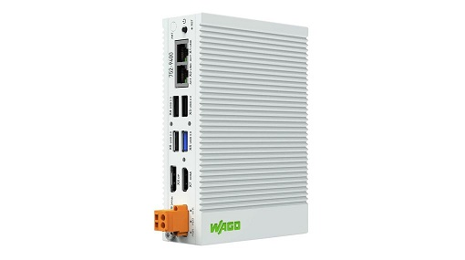

# Debian package to activate CoDeSys [WAGO] libraries on the Edge Computer
- Debian Package for Edge PC equals 752-94xx  

- Howto use  

1. open ssh connection, use putty or integtratet terminal inside cockpit 
2. goto home folder: cd /home 
3. if you device had internet access, download the package: wget *** vendorcheck.deb 
3a.if not, download from repo via Laptop and copy package via scp to the home folder 
4. install package: apt-get install /home/vendor-check.deb  OR  dpkg -i vendorcheck.deb 
5. check installation. apt list | grep vendor-check 
6. check service is running: systemctl status vendor_daemon.service 
7. mount "tmp" folder to your docker container: /tmp:/tmp 
8. (re)start your container via CoDeSys IDE  

<H5>Take care that you have to mount /tmp:/tmp to the Docker container.</H5>
 

