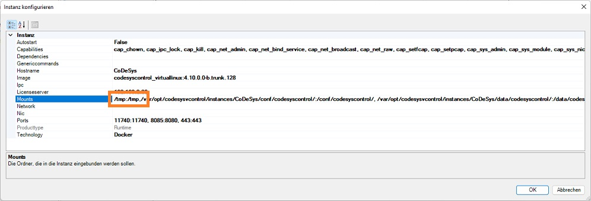

# Debian package to activate CoDeSys [WAGO] libraries on the Edge Computer
- Debian Package for Edge PC equals 752-94xx 
- Working for nativ and virtual CoDeSys Runtimes  

- Howto use  

1.  open ssh connection, use putty or integtratet terminal inside cockpit 
1a. on older devices <FW4 please install "sudo":<pre><code>apt-get install sudo</code></pre>
2.  goto home folder: <pre><code>cd /home</code></pre>
3.  if you device had internet access, download the package direct to your device: 
3a. download directly: <pre><code>wget https://github.com/WAGO/edge-pc-vendorcheck/raw/main/debian%20package/vendorcheck.deb</code></pre>
3b. if not, download from repo via Laptop and copy package via scp to the home folder 
4.  install package: <pre><code>apt-get install /home/vendorcheck.deb  OR  dpkg -i vendorcheck.deb</code></pre>
5.  check installation: <pre><code>apt list | grep vendorcheck</code></pre>
6.  check service is running: <pre><code>systemctl status vendor_daemon.service</code></pre>

7. In case of use a virtual runtime 
7a.  mount "tmp" folder to your docker container: /tmp:/tmp 
7b.  (re)start your container via CoDeSys IDE 

8. In case of use a nativ runtime 
8a. restart your runtime: <pre><code>/etc/init.d/codesyscontrol restart</code></pre>
9.  dowload CoDeSys library from this repo and install inside your IDE 

